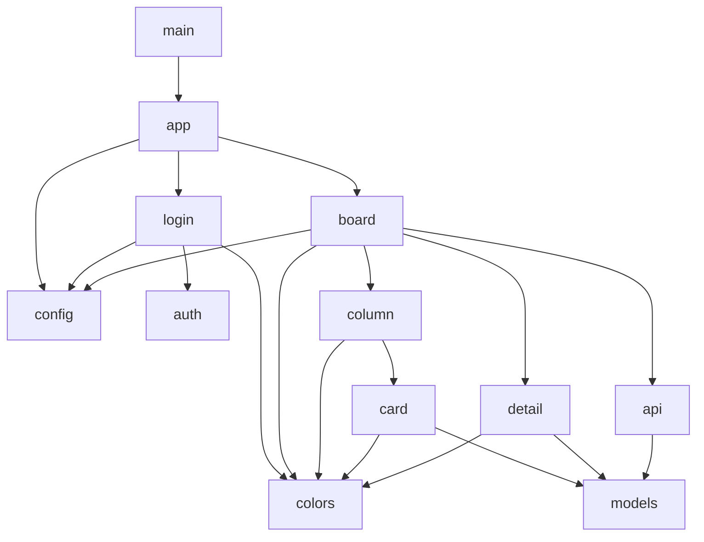
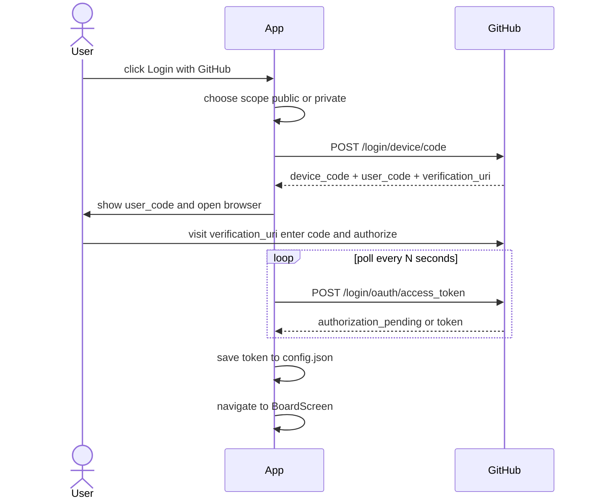
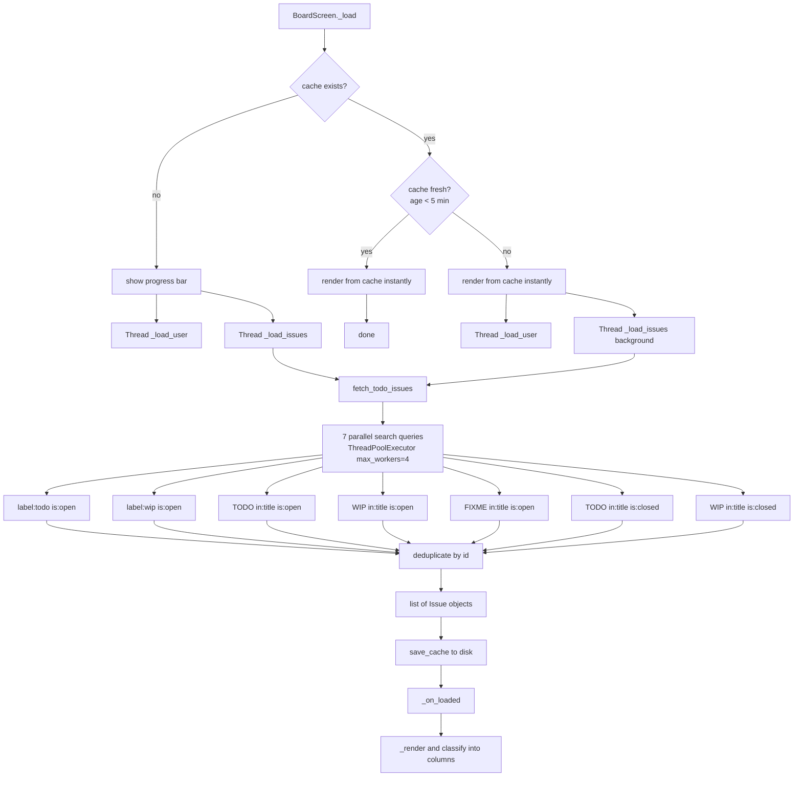
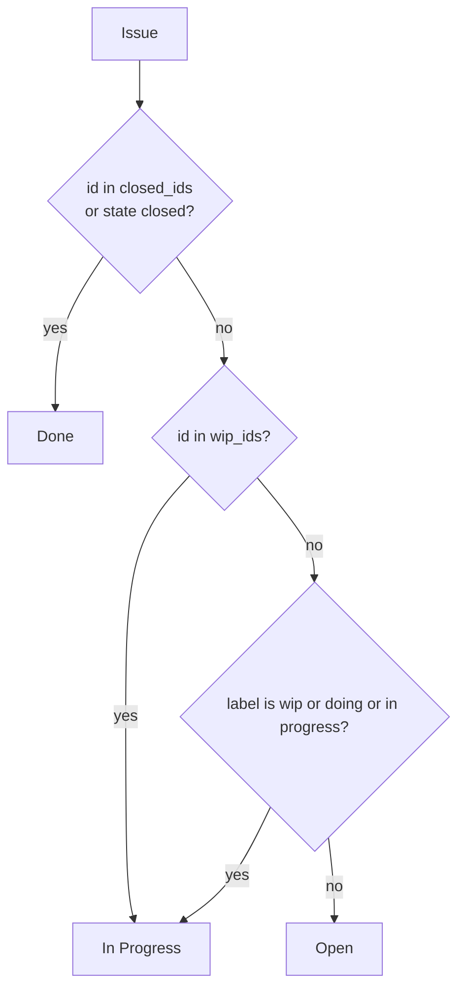
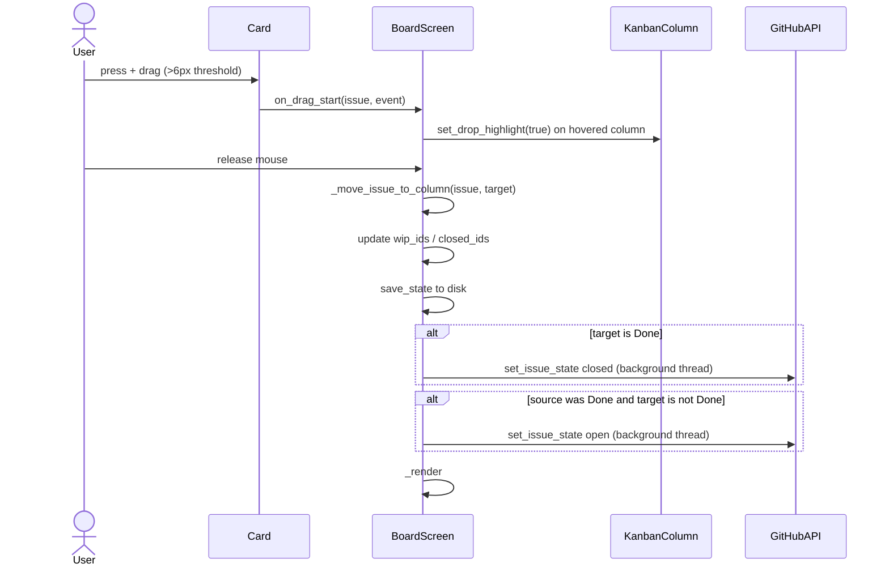
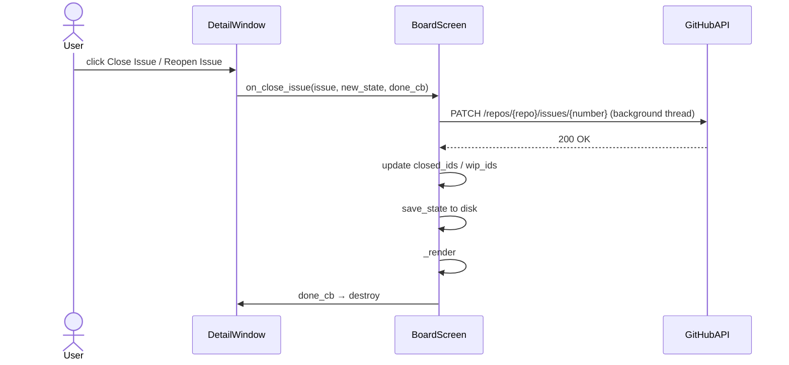
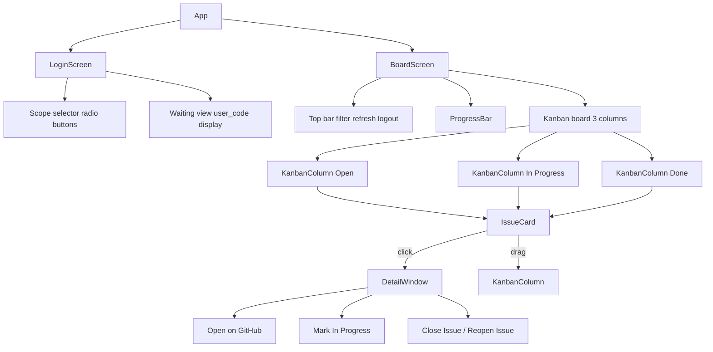
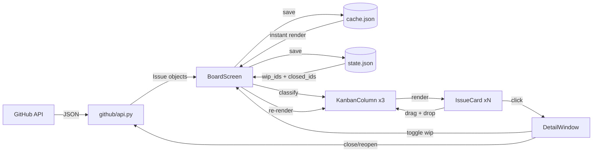
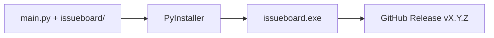

# issueboard — Architecture

issueboard is a desktop kanban app built with Python and customtkinter that authenticates with GitHub via device flow OAuth and surfaces TODO/WIP issues into a three-column board.

---

## Package Structure
```
issueboard/
├── main.py
├── issueboard/
│   ├── app.py
│   ├── config.py
│   ├── models.py
│   ├── github/
│   │   ├── auth.py
│   │   └── api.py
│   └── ui/
│       ├── colors.py
│       ├── login.py
│       ├── board.py
│       ├── column.py
│       ├── card.py
│       └── detail.py
└── assets/
    └── icon.ico
```

---

## Module Dependency Graph


---

## Authentication Flow


---

## Issue Fetching Flow

Cache uses a stale-while-revalidate strategy with a 5-minute TTL stored at `~/.issueboard/cache.json`.


---

## Issue Classification Logic


`wip_ids` and `closed_ids` are persisted to `~/.issueboard/state.json` and loaded on startup. They survive restarts and refreshes.

---

## Drag-and-Drop Flow


---

## Close / Reopen Flow


---

## UI Component Hierarchy


---

## Data Flow


---

## Config Files

All stored at `~/.issueboard/`:

**`config.json`** — authentication token, written after device flow and read on startup to skip login. Logout deletes the token key.
```json
{
  "token": "gho_xxxxxxxxxxxxxxxxxxxx"
}
```

**`cache.json`** — serialized issue list with timestamp. Written after every successful fetch. Read on startup for instant rendering before the API responds.
```json
{
  "ts": 1743000000.0,
  "issues": [
    {
      "id": 123456,
      "title": "TODO: fix thing",
      "url": "https://github.com/...",
      "state": "open",
      "labels": ["todo"],
      "repo": "owner/repo",
      "number": 42,
      "assignee": null,
      "created_at": "2025-01-01",
      "body": "..."
    }
  ]
}
```

**`state.json`** — persisted board state. Survives restarts and cache refreshes. Written every time the user moves a card or toggles WIP.
```json
{
  "wip_ids":    [123456, 789012],
  "closed_ids": [345678]
}
```

---

## Build and Release


Build command:
```bash
pyinstaller --onefile --noconsole --icon=assets/icon.ico --name=issueboard main.py
```

Output is at `dist/issueboard.exe`.
