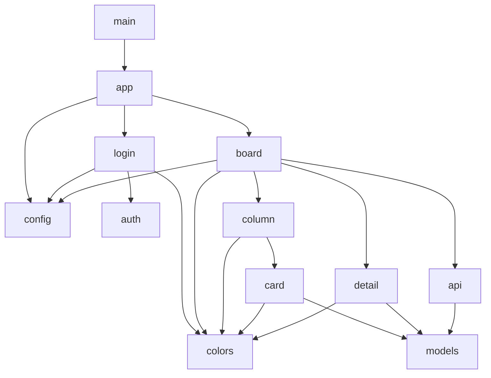
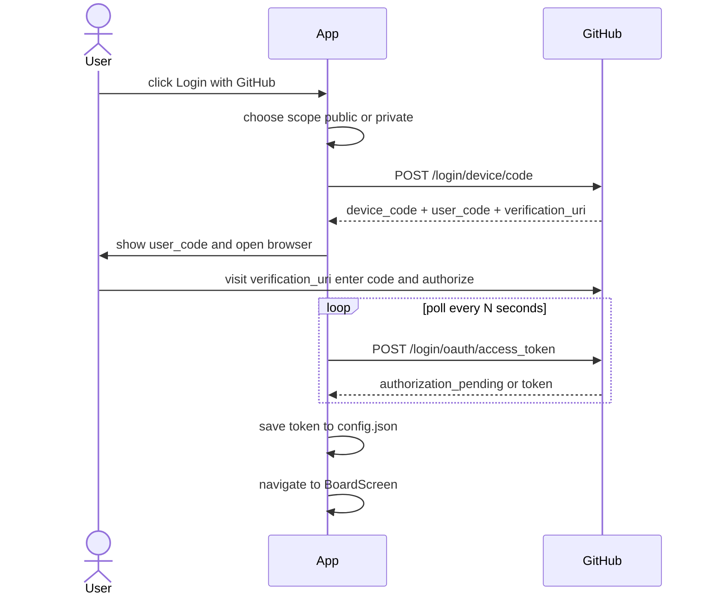
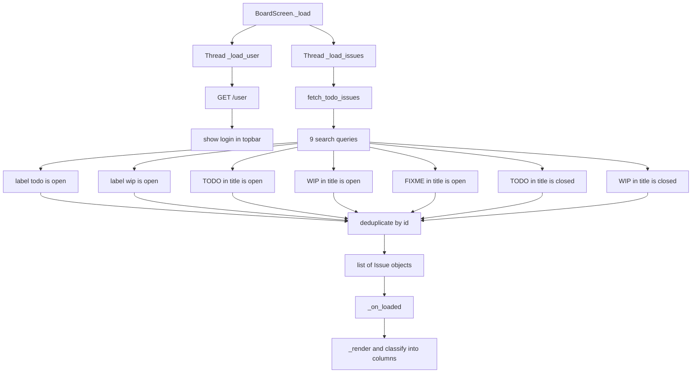
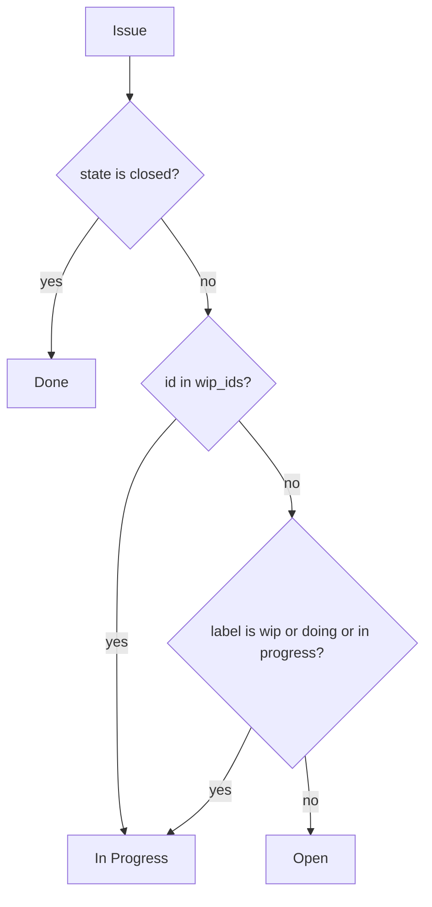
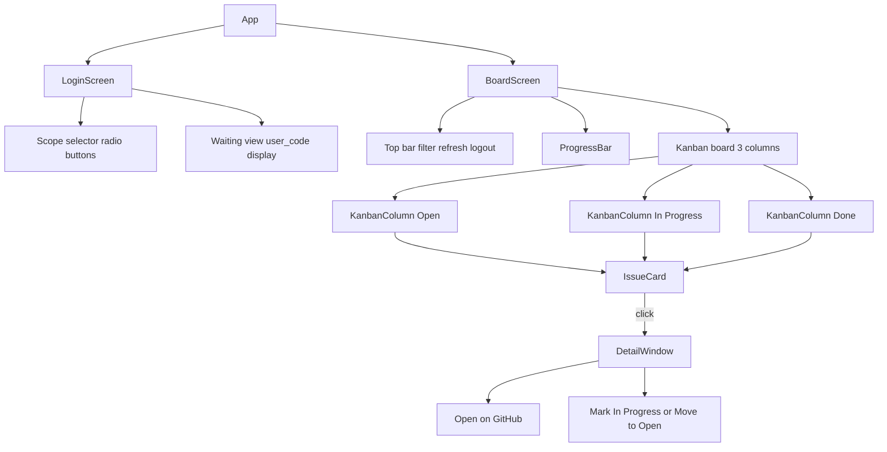
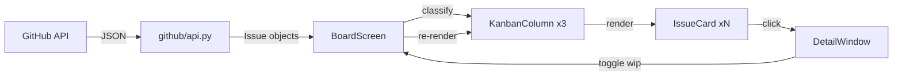
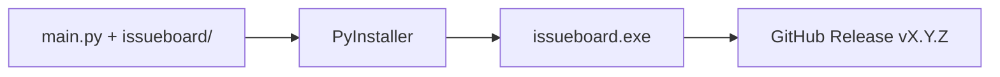

# issueboard — Architecture

issueboard is a desktop kanban app built with Python and customtkinter that authenticates with GitHub via device flow OAuth and surfaces TODO/WIP issues into a three-column board.

---

## Package Structure

```
issueboard/
├── main.py
├── issueboard/
│   ├── app.py
│   ├── config.py
│   ├── models.py
│   ├── github/
│   │   ├── auth.py
│   │   └── api.py
│   └── ui/
│       ├── colors.py
│       ├── login.py
│       ├── board.py
│       ├── column.py
│       ├── card.py
│       └── detail.py
└── assets/
    └── icon.ico
```

---

## Module Dependency Graph



---

## Authentication Flow



---

## Issue Fetching Flow



---

## Issue Classification Logic



`wip_ids` is an in-memory set managed by the user clicking Mark In Progress in the DetailWindow. It resets on refresh.

---

## UI Component Hierarchy



---

## Data Flow



---

## Config File

Stored at `~/.issueboard/config.json`:

```json
{
  "token": "gho_xxxxxxxxxxxxxxxxxxxx"
}
```

The token is written after successful device flow authorization and read on startup to skip the login screen. Logout deletes the token key.

---

## Build and Release



Build command:

```bash
pyinstaller --onefile --noconsole --icon=assets/icon.ico --name=issueboard main.py
```

Output is at `dist/issueboard.exe`.
